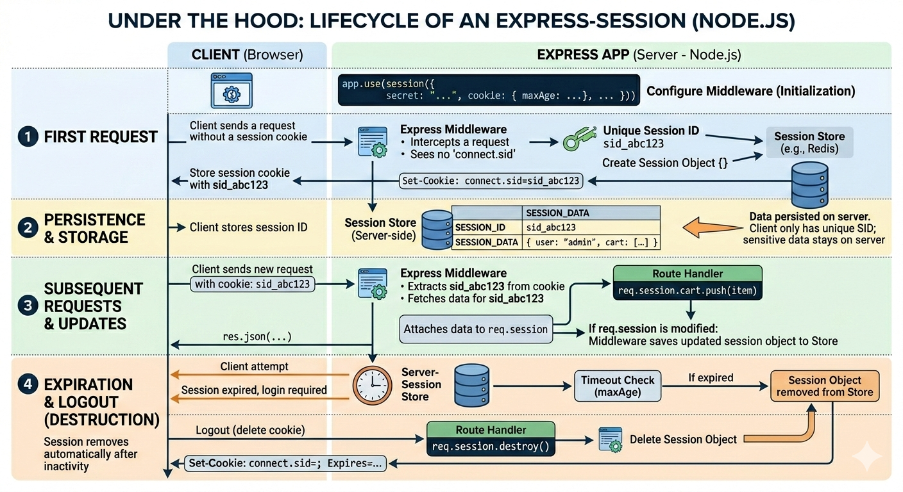
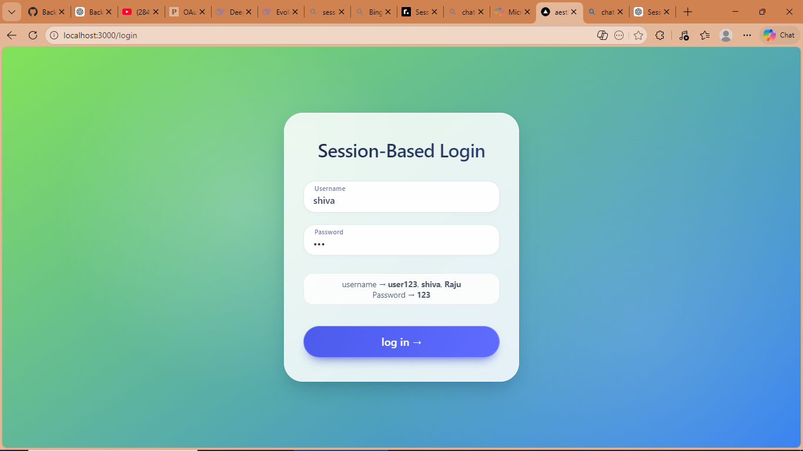
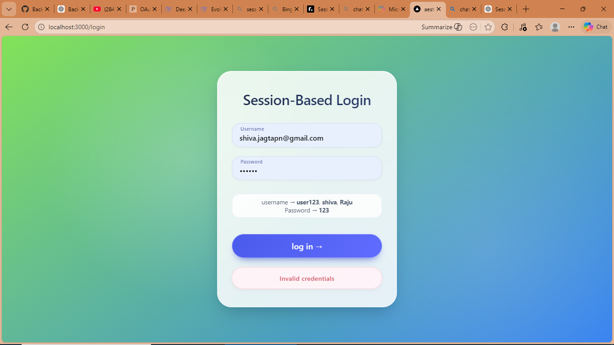
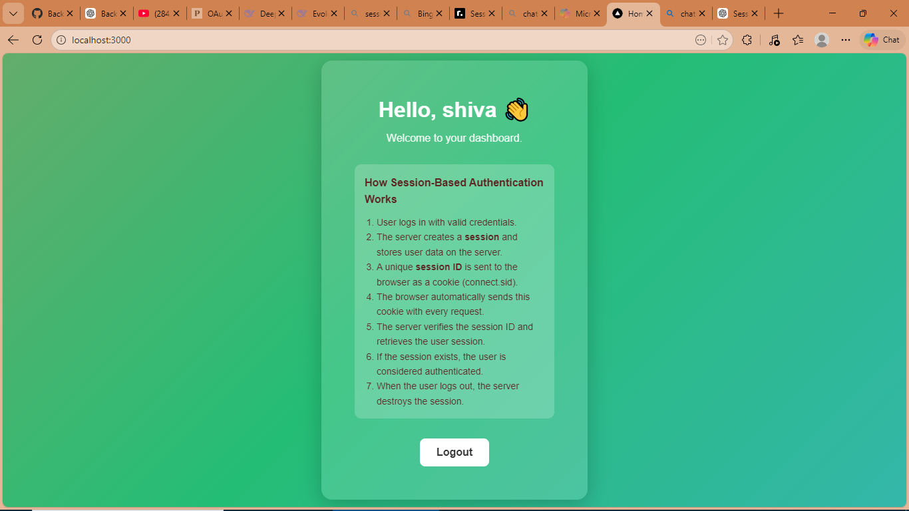

# Session-Based Authentication Demo (Node.js + Express)

A simple authentication system built using **Node.js, Express, EJS, and express-session** to demonstrate how **session-based authentication works**.

This project includes:

* Login page
* Session creation after authentication
* Protected home route
* Logout functionality
* Demonstration users for testing

---

# 🚀 Features

* Session-based authentication
* Express session middleware
* Protected routes
* Login error handling
* Logout with session destruction
* Clean UI with animated gradient backgrounds
* EJS templating

---

# 🧠 How Session-Based Authentication Works

1. User submits login credentials.
2. Server validates the credentials.
3. If valid, the server creates a **session**.
4. The session ID is stored in a **cookie (`connect.sid`)** in the browser.
5. For every request, the browser sends this cookie automatically.
6. The server checks the session ID and retrieves the stored session.
7. If the session exists, the user is authenticated.
8. When the user logs out, the session is destroyed.

## workflow



---


Architecture flow:

Browser
↓
Login Request
↓
Server creates Session
↓
Session ID stored in Cookie
↓
Browser sends Cookie in every request
↓
Server verifies session

---

# 👤 Demo Credentials

You can log in using the following demo accounts:

| Username | Password |
| -------- | -------- |
| user123  | 123      |
| shiva    | 123      |
| Raju     | 123      |

---

# 📸 Screenshots

## Login Page



---

## Login Error Example



---

## Home Dashboard



---

# 🛠 Tech Stack

* **Node.js**
* **Express.js**
* **express-session**
* **EJS**
* **HTML / CSS**

---

# 📂 Project Structure

```
project
│
├── views
│   ├── login.ejs
│   └── home.ejs
│
├── screenshots
│   ├── login.png
│   ├── login-error.png
│   └── dashboard.png
│
├── server.js
├── package.json
└── README.md
```

---

# ⚙️ Installation

Clone the repository

```
git clone https://github.com/yourusername/session-auth-demo.git
```

Navigate into the project

```
cd session-auth-demo
```

Install dependencies

```
npm install
```

---

# ▶️ Run the Application

Start the server:

```
node server.js
```

Server will start on:

```
http://localhost:3000
```

---

# 🔐 Important Notes

* This project uses **in-memory session storage**, which is suitable for demos but **not recommended for production**.

* In production environments, sessions should be stored in:

* Redis

* Database

* Distributed session store

Example:

```
Redis Session Store
```

---

# 📈 Future Improvements

Possible enhancements:

* Redis session store
* Rate limiting for login attempts
* CSRF protection
* Password hashing with bcrypt
* JWT authentication comparison
* Remember-me functionality
* OAuth login (Google/GitHub)

---

# 📜 License

This project is open-source and available under the MIT License.

---

# 👨‍💻 Author

**Shiva Swami**

Software Engineer | Backend Enthusiast

---

If you found this project helpful, consider giving it a ⭐ on GitHub.
