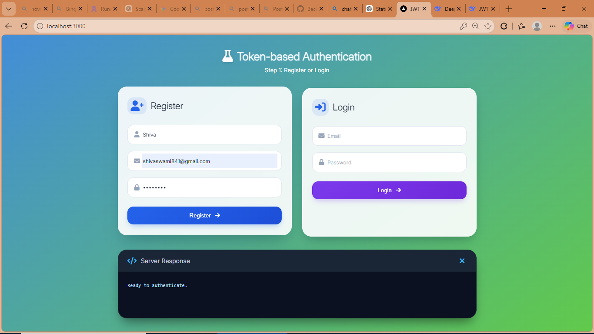
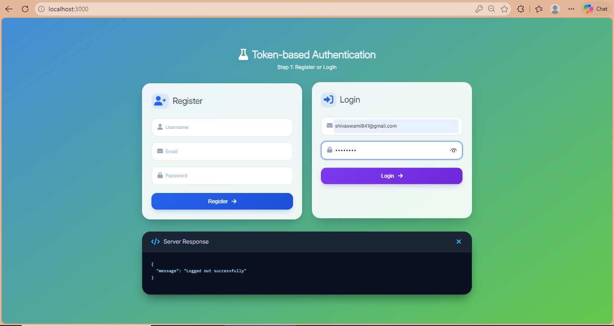
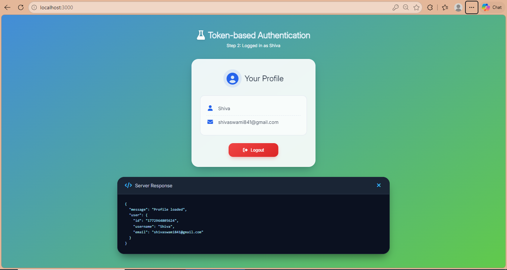
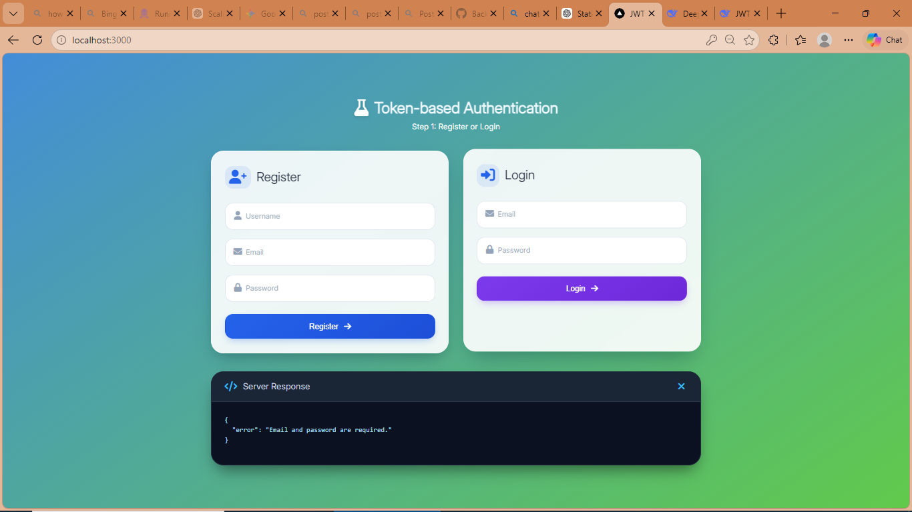
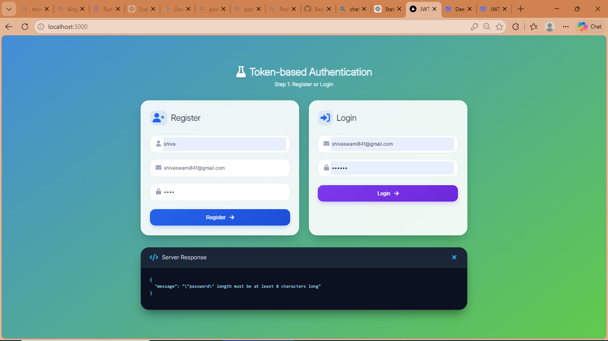

# Production-Level Token-Based Authentication API


This project provides a secure, token-based authentication system built with **Node.js** and **Express**. It uses **JSON Web Tokens (JWT)** for authentication and implements several security best practices.

---

# Features

* **User Registration**
  Secure password hashing using `bcrypt`.

* **User Login**
  Generates a **JSON Web Token (JWT)** upon successful login.

* **Protected Routes**
  Middleware to verify JWT tokens and restrict access.

* **Security Middleware**

  * `helmet` — Sets various HTTP headers to secure the app
  * `cors` — Enables Cross-Origin Resource Sharing
  * `express-rate-limit` — Prevents brute-force attacks and DDoS

* **Input Validation**
  Uses `joi` to validate request payloads.

* **Mock Database**
  Uses in-memory storage simulation with async operations to mimic real database interactions.

---

# Architecture

The project follows the **Model-View-Controller (MVC)** pattern (without views since it's an API).

```
Authentication/token-based/
├── server.js
├── .env.example
├── package.json
└── src/
    ├── controllers/
    │   └── auth.controller.js
    ├── middlewares/
    │   └── auth.middleware.js
    ├── models/
    │   └── user.model.js
    └── routes/
        └── auth.routes.js
```

| Folder      | Description                       |
| ----------- | --------------------------------- |
| controllers | Business logic for authentication |
| middlewares | JWT authentication middleware     |
| models      | User model and mock database      |
| routes      | API endpoints                     |

---


## Authentication Flow

```
Client
   │
   │ Register / Login
   ▼
Express API
   │
   │ Validate Input (Joi)
   ▼
Controller
   │
   │ Hash Password (bcrypt)
   │ Generate Token (JWT)
   ▼
Response → JWT Token
   │
   │
Client stores token
   │
   │ Authorization: Bearer <token>
   ▼
Protected Routes
   │
JWT Middleware verifies token
   ▼
User Profile Data
```

## Rate Limiting Protection

The API uses `express-rate-limit` to prevent abuse.

Example limit:

```
100 requests per 15 minutes per IP
```

If the limit is exceeded:

```json
{
 "status": 429,
 "message": "Too many requests from this IP, please try again after 15 minutes"
}
```


# Setup Instructions

## 1. Navigate to the project

```bash
cd Authentication/token-based
```

## 2. Install dependencies

```bash
npm install
```

## 3. Setup environment variables

Copy the example file:

```bash
cp .env.example .env
```

Update values inside `.env`.

Example:

```
PORT=3000
JWT_SECRET=your_super_secret_key
JWT_EXPIRES_IN=1h
```

⚠️ Always use a **strong secret key in production**.

---

## 4. Run the server

```bash
node server.js
```

Server will start at:

```
http://localhost:3000
```

---

# API Endpoints

## Register User

```
POST /api/auth/register
```

Request Body

```json
{
 "username": "user123",
 "email": "user@example.com",
 "password": "password123"
}
```

---

## Login User

```
POST /api/auth/login
```

Request Body

```json
{
 "email": "user@example.com",
 "password": "password123"
}
```

Response

```json
{
 "token": "JWT_TOKEN"
}
```

---

## Get Profile (Protected Route)

```
GET /api/auth/profile
```

Header

```
Authorization: Bearer <your_jwt_token>
```

---

# Security Best Practices Included

### Password Hashing

Passwords are hashed using **bcrypt** before storing.

### JWT Expiration

Tokens expire automatically to reduce risk if compromised.

### Rate Limiting

Limits repeated API requests to prevent brute-force attacks.

### Input Validation

Validates user input using `joi`.

### Secure HTTP Headers

`helmet` protects against:

* XSS attacks
* Clickjacking
* MIME sniffing
* Other common vulnerabilities

---

# Screenshots

## Register



---

## Login



---

## Profile



---

## Logout


---

## Email & Password Required Validation



---

## Incorrect Password



---

## Incorrect Username


---

# Technologies Used

* Node.js
* Express.js
* JWT
* bcrypt
* Joi
* Helmet
* CORS
* Express Rate Limit

---

# Future Improvements

Possible enhancements:

* Database integration (PostgreSQL / MongoDB)
* Refresh tokens
* Redis-based rate limiting
* Email verification
* Password reset
* Role-based access control

---

## Project Highlights

✔ Secure password hashing using bcrypt
✔ JWT-based authentication
✔ Middleware-based route protection
✔ Rate limiting against brute-force attacks
✔ Input validation using Joi
✔ Modular MVC architecture
✔ Production-grade security middleware


# License

This project is open source and available under the **MIT License**.
